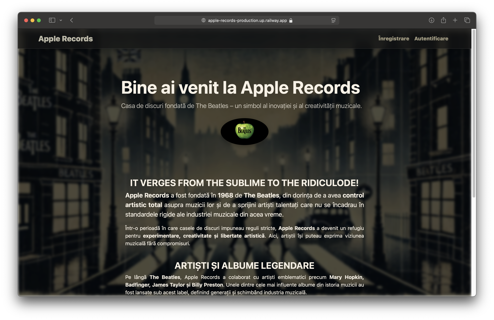
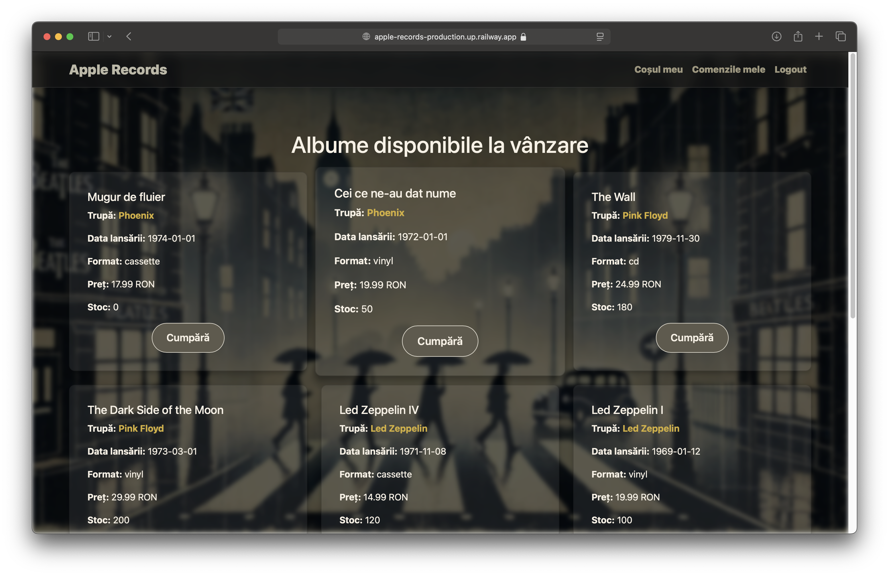

# Apple Records – Sistem Digital de Management pentru Casa de Discuri

**Apple Records** este o aplicație web, realizată în PHP și MySQL, concepută pentru a gestiona operațiunile unei case de discuri. Sistemul facilitează interacțiunea dintre clienți, membri de trupă, staff și administratori.

> **Notă despre Docker**: Aplicația rulează într-un container Docker care include mediul PHP și Apache. Fișierele sursă, împreună cu `composer.json`, sunt copiate în container, iar extensiile PHP necesare sunt instalate (ex: `ext-pdo`, `ext-pdo_mysql`, `ext-gd`). Dockerfile-ul asigură instalarea dependențelor prin Composer și configurarea automată a serverului local.

---

# Apple Records - Platformă de Gestionare a Artiștilor și Casei de Discuri  

## 📌 Descriere  
Apple Records este o platformă web dezvoltată în **PHP** și **MySQL**, concepută pentru a facilita colaborarea dintre artiști și casa de discuri Apple Records, fondata de **The Beatles**. Aplicația oferă un sistem bine structurat de gestionare a utilizatorilor și resurselor, având un accent puternic pe organizare, accesibilitate și securitate.  

---

## 🚀 Funcționalități Principale  

### 🔐 Autentificare și Gestionare Utilizatori  
- Sistem complet de **autentificare și înregistrare**, cu protecția sesiunilor și gestionarea utilizatorilor.  
- Separarea clară a **rolurilor** utilizatorilor, fiecare având drepturi și acțiuni specifice.  

### 🎵 Clienții platformei

- Clienții care achiziționează albume prin această platformă sunt adevărați pasionați de muzică, interesați de descoperirea și susținerea artiștilor emergenți. Indiferent dacă sunt colecționari de **vinyl**, nostalgici ai **casetelor** sau preferă formatul **CD**, aceștia au acces la o selecție exclusivă de lansări, direct de la artiștii preferați. 
- Platforma oferă o experiență simplă și intuitivă pentru cumpărarea de albume, asigurând o conexiune autentică între creatori și ascultători.

### 🎵 Gestionarea Cererilor de Contract și Albume  
- Membrii trupelor pot **înainta cereri de contract**, aprobate sau respinse de staff.  
- După aprobare, membrii pot solicita lansarea de albume și gestiona detalii legate de acestea.  

### 📑 Generare și Export de Rapoarte  
- Exportul **datelor în diverse formate** precum **CSV, XLSX, PDF, DOC**, permițând administrarea eficientă a informațiilor.  

### 📊 Monitorizare Activitate și Statistică  
- Sistem de **logare a activităților** utilizatorilor, oferind transparență și date relevante despre accesări și interacțiuni.  

### 📧 Formular de Contact și Trimitere Email  
- Implementarea unui **formular de contact** pentru comunicare directă, cu protecție împotriva transmiterii automate.  

### 🔗 Integrarea Informațiilor din Surse Externe  
- Preluarea și afișarea **dinamica a conținutului** din surse externe, adaptat specificului platformei.  

### 🎥 Elemente Multimedia  
- Integrarea **elementelor multimedia** pentru o experiență interactivă îmbunătățită.  

### 🔒 Securitate și Protecție  
- Aplicația este protejată împotriva atacurilor comune precum **Form Spoofing, SQL Injection, XSS, CSRF** etc.  
- Implementarea unui **mecanism de protecție anti-bot** pentru formularele publice.  

### 🖥️ Interfață Modernă și Responsive  
- Design optimizat cu **Bootstrap**, asigurând compatibilitate pe diverse browsere și dispozitive. 

---

## ⚙️ Tehnologii Utilizate  
- **Backend:** PHP, MySQL  
- **Frontend:** Bootstrap, HTML, CSS, JavaScript  
- **Autentificare și Securitate:** Gestionarea sesiunilor, recaptcha, protecție XSS/CSRF  
- **Export și Generare de Rapoarte:** PhpSpreadsheet, MPDF  

---

## Instrucțiuni de Configurare

Pentru detalii despre configurare, vezi fișierul [setup.md](setup.md). Acesta acoperă:

1. **Configurarea containerului Docker** și pornirea aplicației  
2. **Mediul de dezvoltare** și integrarea cu BrowserSync  
3. Accesul la aplicație și ajustarea setărilor  

## Arhitectura Aplicației

Pentru detalii despre arhitectura aplicației, vezi fișierul [architecture.md](architecture.md).