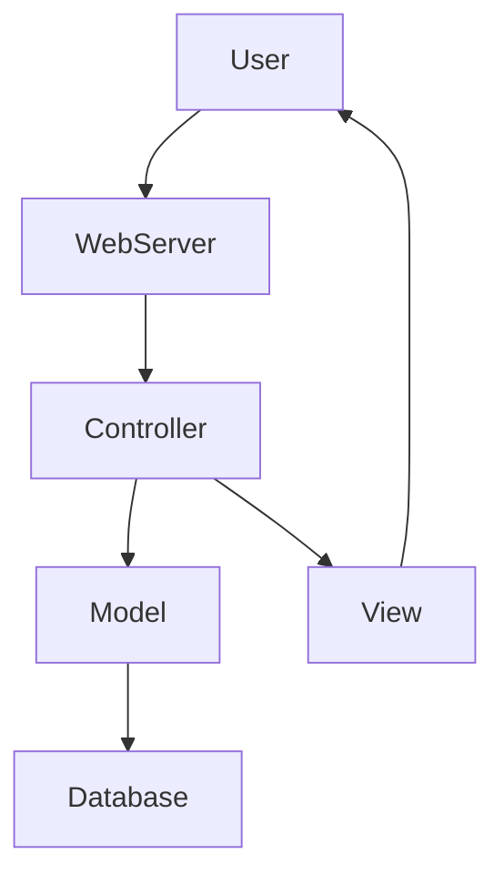
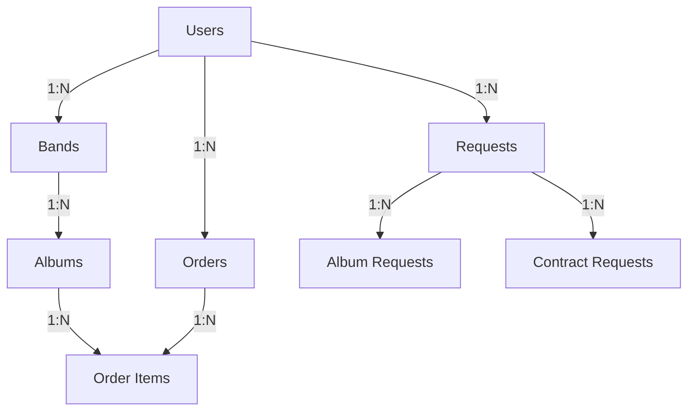
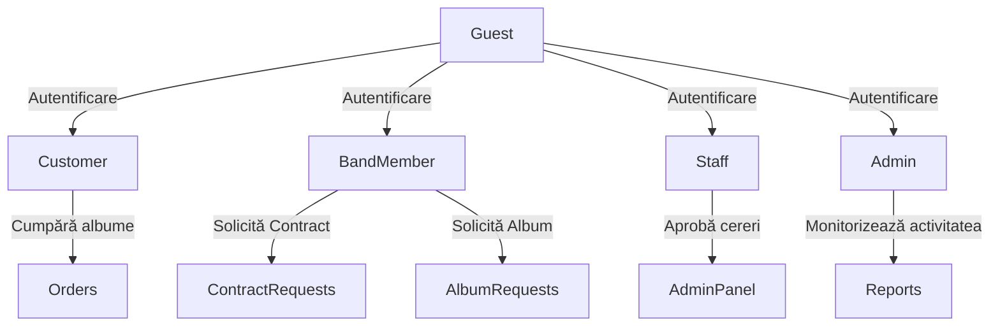
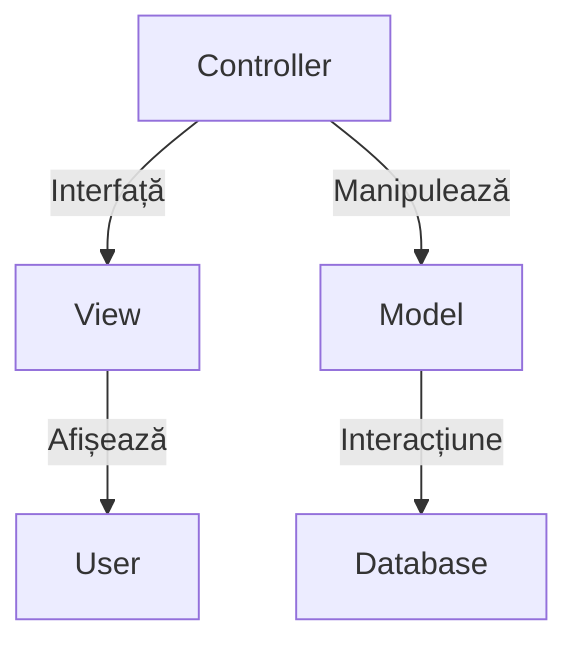

# 📌 Descrierea Arhitecturii Aplicației

Această aplicație PHP oferă un sistem complex pentru gestionarea utilizatorilor, trupei, albumelor și comenzilor de muzică, permițând interacțiuni dinamice între diferite categorii de utilizatori. 

Aplicația este construită folosind arhitectura **MVC** și este susținută de o bază de date **MySQL**. Oferă autentificare securizată, roluri distincte pentru utilizatori și generare de rapoarte în diferite formate. 

## 📌 Arhitectura Generală a Aplicației

Aplicația urmează arhitectura **MVC** (Model-View-Controller), asigurând o separare clară între logica aplicației, interfața utilizatorului și gestionarea datelor.

## 📌 Baza de Date

Aplicația folosește o bază de date relațională cu mai multe tabele pentru gestionarea utilizatorilor, albumelor, comenzilor și cererilor de contract. Structura bazei de date este ilustrată mai jos:

### 📌 Principalele Tabele
- **Users**: gestionarea utilizatorilor și a rolurilor acestora
- **Bands**: informații despre trupe
- **Albums**: detalii despre albumele disponibile
- **Orders**: comenzile plasate de utilizatori
- **Requests**: cererile pentru contracte și albume
- **User Activity**: monitorizarea activității utilizatorilor

## 📌 Fluxul Experienței Utilizatorului

Aplicația include mai multe tipuri de utilizatori, fiecare cu funcționalități specifice:

- **Vizitatorii** se pot înregistra și autentifica
- **Clienții** pot naviga prin catalogul de albume și plasa comenzi
- **Membrii trupei** pot solicita contracte și albume
- **Staff-ul** poate aproba/revizui cererile de albume și contracte
- **Administratorul** are acces la rapoarte și statistici

## 📌 Modelul MVC al Backend-ului

- **Controllers**: gestionează logica aplicației
- **Models**: interacționează cu baza de date
- **Views**: generează interfața utilizatorului
- **Database**: stochează și gestionează datele

## 📌 Funcționalități Implementate

✅ **Autentificare și Înregistrare** 

✅ **Gestionarea utilizatorilor și a rolurilor** 

✅ **Cereri de contract pentru trupe** 

✅ **Plasarea și gestionarea comenzilor** 

✅ **Generare de rapoarte în format PDF, Excel, DOC** 

✅ **Protecție împotriva atacurilor XSS, CSRF și SQL Injection** 

✅ **Monitorizare activitate utilizatori** 

✅ **Formulare securizate cu reCAPTCHA**

Această aplicație oferă o platformă robustă pentru gestionarea trupei și a vânzărilor de albume, punând accent pe securitate, flexibilitate și scalabilitate.
